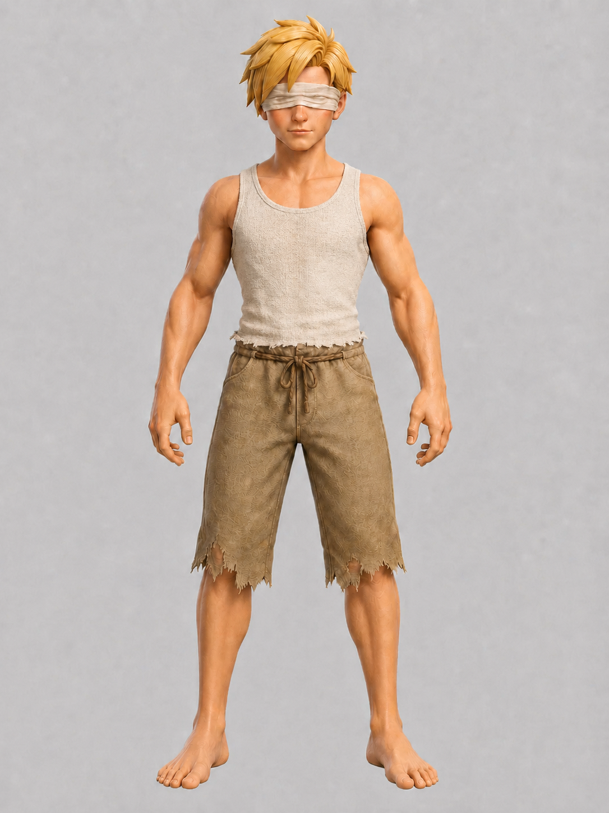
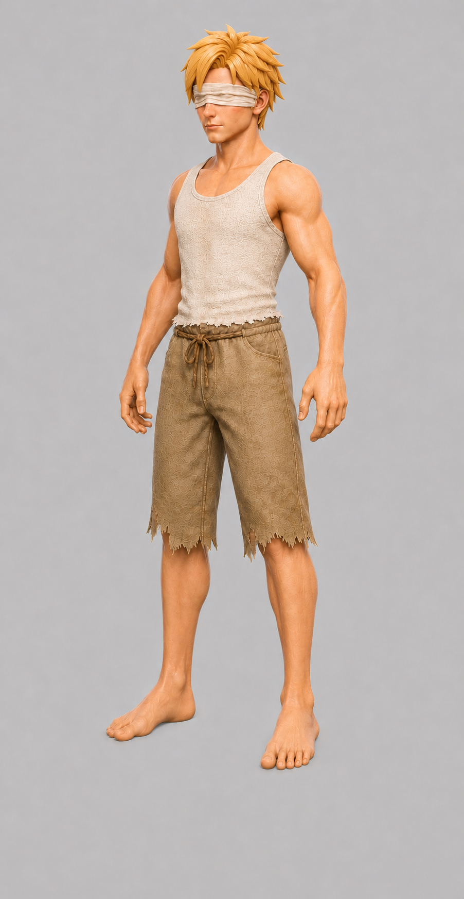
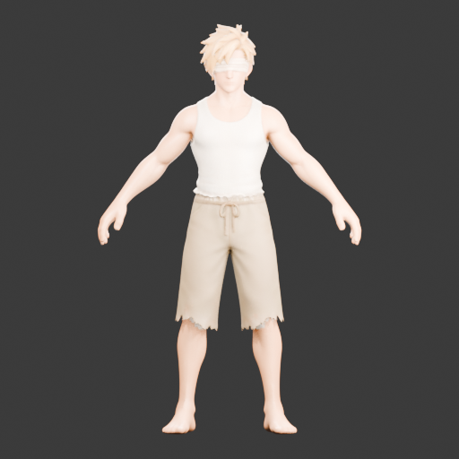
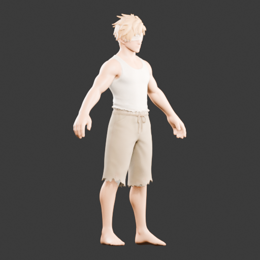
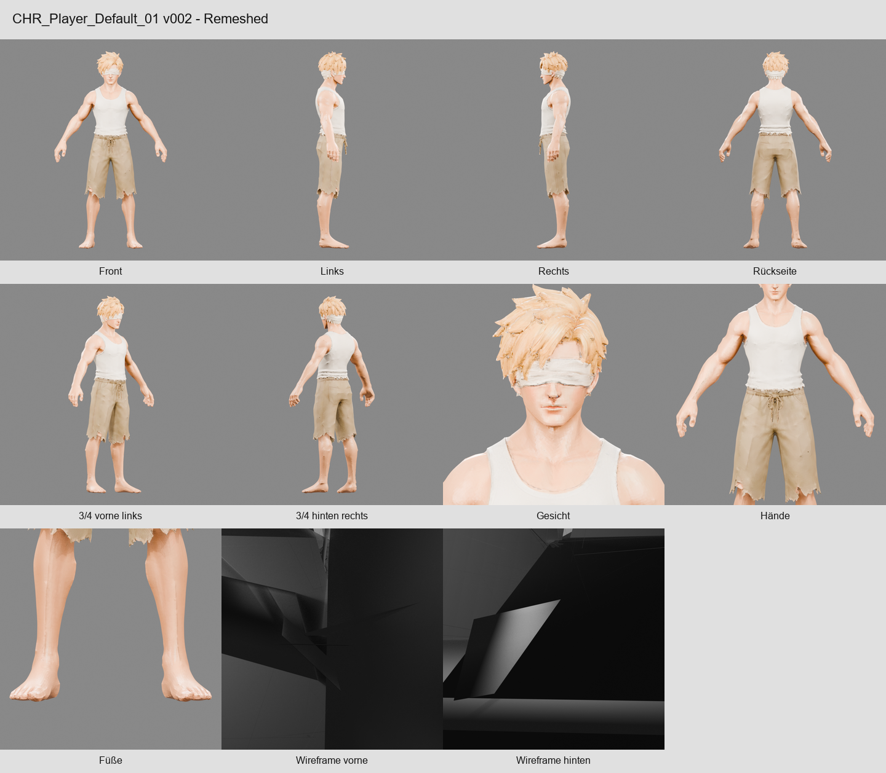

# Meshy–Blender Character Pipeline

An experimental Python workflow that connects multi-view character references,
Meshy AI jobs, local Blender validation, and Unreal-ready 3D exports.

> **Status:** Experimental / Active Development  
> This is a personal workflow-automation project, not a production-ready asset
> generator. Its purpose is to explore reliable orchestration between AI-based
> mesh services and traditional 3D tools.

## Showcase

### Reference input

The tested job used four project-specific reference views. They are included as
documentation, not as a reusable dataset.

<p align="center">
  
  
  
  
</p>

### Generated and validated output

<p align="center">
  
  
</p>

<details>
<summary>Earlier local review contact sheet</summary>



</details>

## Overview

The project investigates how much of a character-asset workflow can be
coordinated through local files and Python. It validates a prepared job,
submits explicitly approved asynchronous Meshy tasks, downloads the results,
and runs Blender in the background for technical checks and preview rendering.

The practical conclusion is intentionally modest: for individual assets,
manual work in Meshy and Blender can still be faster. The value of this project
is the orchestration itself, the resumable job state, and the documented limits
of generated geometry.

## Pipeline


## What is implemented

- Fixed four-view input contract: front, left, back, and three-quarter.
- Image integrity checks using stored SHA-256 values.
- Offline planning modes that block Meshy network access.
- Explicit per-job permission and credit-cap checks before paid requests.
- Meshy `multi-image-to-3d`, `remesh`, and `retexture` tasks.
- Persistent task IDs so interrupted jobs can continue without creating a new
  paid task.
- Server-Sent Events monitoring with one reconnect attempt and GET polling as a
  fallback.
- Parallel, temporary-file downloads with basic GLB, FBX, and image validation.
- Blender checks for importability, materials, UVs, PBR connections, external
  textures, and preview creation.
- An older optional processing path for already-rigged assets, including scale,
  grounding, weight normalization, texture export, and GLB/FBX export.
- A separate Unreal Python import helper. The current pipeline does not launch
  Unreal automatically.

## Documented result

One retained job report demonstrates a completed three-stage final-mesh run:

| Phase | Recorded credits | Output |
| --- | ---: | --- |
| Multi-image geometry | 20 | GLB |
| Quad remesh | 5 | GLB, target 60,000 polygons |
| 4K PBR retexture | 10 | GLB, FBX, and texture maps |

The resulting GLB imported successfully in Blender. The validator detected a
material, a UV map, Base Color, Normal, Roughness, and Metallic connections,
and produced five preview images.

This is not evidence that the final mesh is production-ready. An earlier
remeshed result contained **209,830 non-manifold edges**, **46,414 separate mesh
islands**, and two degenerate faces. A pre-remeshed geometry reference was
manifold but had no UVs or materials. The current final validator does not
repeat the non-manifold measurement, so the final topology remains unverified.

## Technologies

- Python
- Meshy REST API
- Requests
- Pillow
- python-dotenv
- Blender and the Blender Python API (`bpy`, `bmesh`)
- Windows batch launchers
- Unreal Python API for the separate import helper

## Project structure

```text
.
├── run_pipeline.py             # Workspace jobs and legacy/local modes
├── final_mesh_pipeline.py      # Geometry → remesh → retexture workflow
├── meshy_client.py             # Meshy API client used by the legacy path
├── pipeline_config.json        # Safe defaults and quality profile
├── blender/
│   ├── validate_final_mesh.py  # Current headless validation and renders
│   ├── process_character.py    # Processing for already-rigged assets
│   └── render_validation_views.py
├── unreal/import_character.py  # Manually invoked Unreal import helper
├── scripts/check_secrets.py    # Local repository secret check
├── tests/test_security.py      # Network-session security tests
└── docs/images/                # Curated portfolio images only
```

Large jobs, models, textures, `.blend` files, logs, backups, and local virtual
environments are deliberately excluded from version control.

## Setup

The launch scripts target Windows. Python modules other than the Blender
scripts can be installed in a normal virtual environment:

```powershell
python -m venv .venv
.\.venv\Scripts\Activate.ps1
python -m pip install -r requirements.txt
```

Set the workspace path if it is not located at
`Desktop\IsekaiAscension_Workspace`:

```powershell
$env:CHARACTER_PIPELINE_WORKSPACE = "C:\path\to\IsekaiAscension_Workspace"
```

The workspace must contain `00_START_HERE/workspace.json`, a jobs directory,
and an existing job with the expected numbered folders. The configured
`character_pipeline_dir` must point to this checkout.

### Optional Meshy credentials

Offline planning and code tests do not require an API key. Real Meshy requests
require a locally created `.env` file:

```dotenv
MESHY_API_KEY=your_api_key_here
```

Never commit this file. Start from `.env.example`, and enable API calls only for
the individual job that is intentionally allowed to consume credits.

## Usage

Safe offline inspection:

```powershell
.\Run-WorkspaceJob.cmd --latest-job --preflight
.\Run-WorkspaceJob.cmd --latest-job --plan-final-mesh
```

A paid final build is available only after the job contains the exact supported
configuration plus `allow_meshy_api_calls=true` and the required credit cap:

```powershell
.\Run-WorkspaceJob.cmd --latest-job --build-final-mesh
```

The permission flag is reset before network work begins. Each phase creates at
most one task, persists its task ID immediately, and performs no automatic paid
retry after failure or timeout.

## Security model

- The API key is loaded only from the environment or the ignored `.env` file.
- Authenticated Meshy API traffic and asset downloads use separate HTTP
  sessions, preventing the bearer token from being forwarded to a storage/CDN
  download host.
- Planning modes block both Meshy network requests and POST requests.
- Signed asset URLs are used in memory and are not retained in reports.
- Downloads are written to temporary files, checked, and then renamed.
- Rigging and automatic Unreal import are disabled in the current final profile.

Run the repository check before committing:

```powershell
python scripts/check_secrets.py
python -m unittest discover -s tests
```

See [SECURITY.md](SECURITY.md) for credential-handling guidance.

## Limitations

- AI-generated meshes can require substantial manual cleanup and retopology.
- Non-manifold geometry is not repaired automatically and is not yet measured
  by the current final-mesh validator.
- Several visual criteria in the validator are reminders for manual review, not
  computer-vision assessments.
- Results depend heavily on the reference images and the external Meshy model.
- Rigging, deformation testing, and weight correction remain separate work.
- Unreal import is not part of the automatic final-mesh path.
- The workspace contract and launch scripts are currently Windows-oriented.
- For a single asset, manual processing may be faster than running the complete
  automated workflow.

## What I learned

- Designing resumable workflows around asynchronous API jobs.
- Persisting state before and after paid external operations.
- Separating offline planning from explicitly authorized network execution.
- Validating and organizing file-based 3D asset pipelines.
- Driving Blender headlessly and extracting machine-readable validation data.
- Handling the gap between visually convincing AI output and usable topology.
- Evaluating when automation adds reliability and traceability rather than raw
  speed.

## Status

Experimental and under active development. The next priorities are a complete
topology validator, mocked API integration tests, a portable workspace schema,
and clearer retirement of the older rigging workflow.
